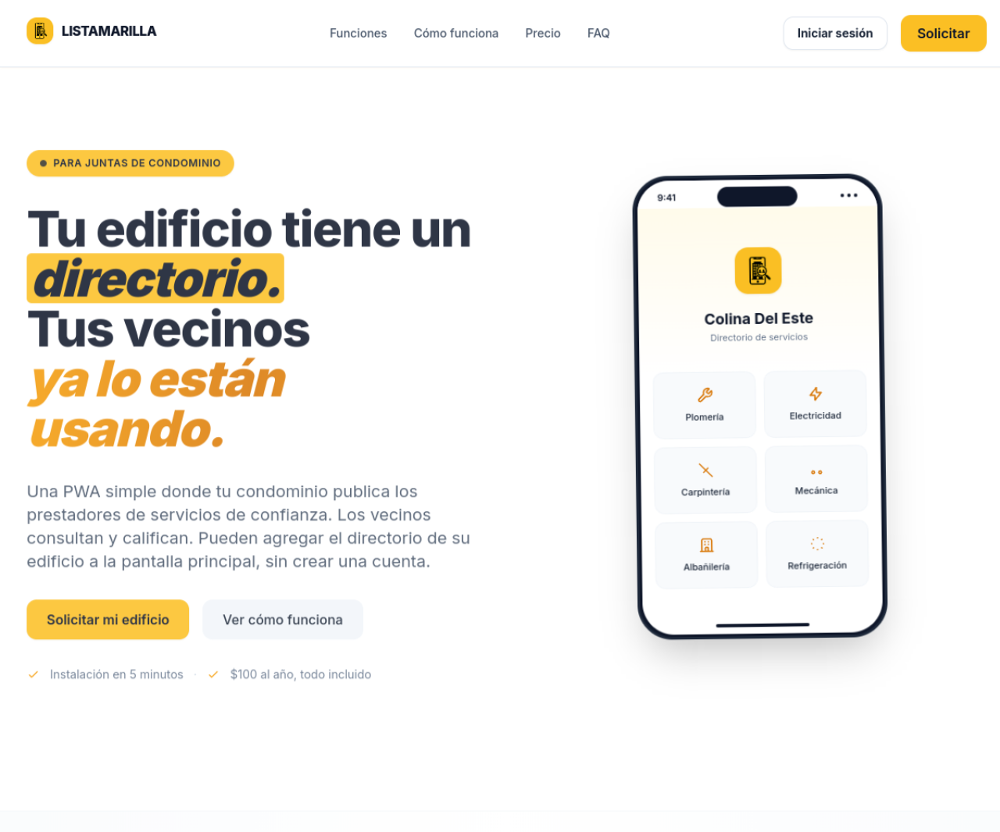
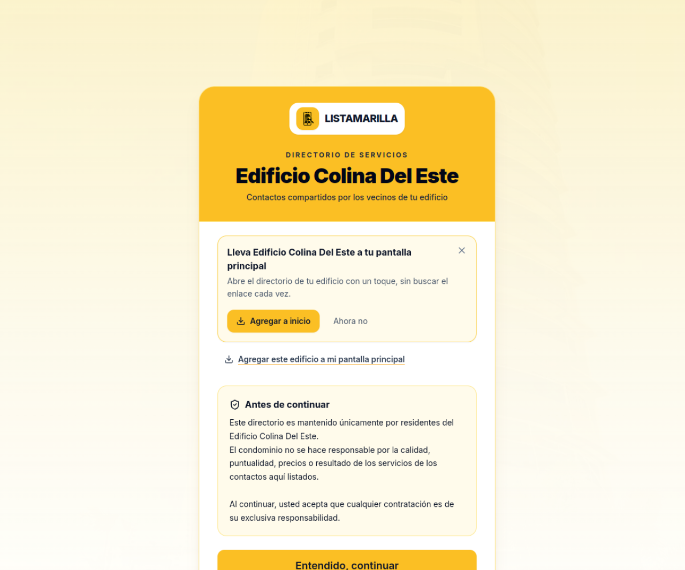
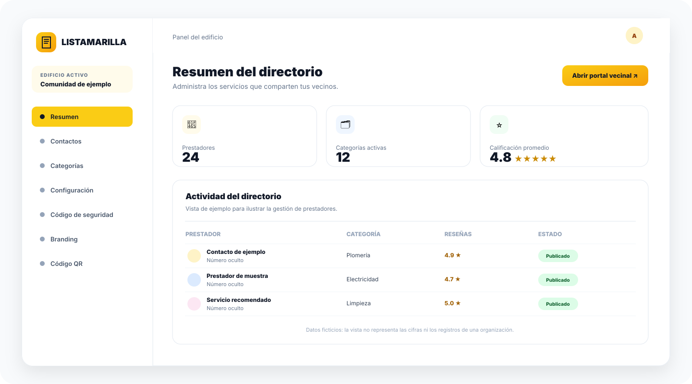
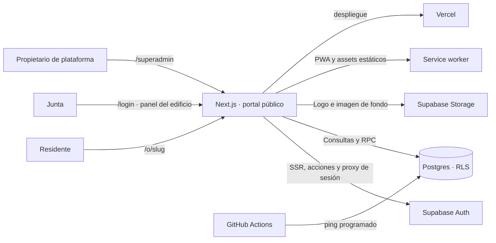

<div align="center">
  
  <h1>Listamarilla</h1>
  <p><strong>El directorio de confianza que vive en cada edificio.</strong></p>
  <p>Una plataforma para que las juntas organicen servicios recomendados y los vecinos encuentren ayuda cerca de casa.</p>

  <p>
    <a href="https://listamarilla.vercel.app"></a>
    
    
    
    
  </p>
</div>

<br />

<p align="center">
  
</p>

<p align="center"><sub>Landing pública de producción · captura del 29 de septiembre de 2026.</sub></p>

## Contenido

- [Qué es Listamarilla](#qué-es-listamarilla)
- [El producto por dentro](#el-producto-por-dentro)
- [Vistas del producto](#vistas-del-producto)
- [Recorridos de uso](#recorridos-de-uso)
- [Arquitectura](#arquitectura)
- [Stack](#stack)
- [Inicio local](#inicio-local)
- [Variables de entorno](#variables-de-entorno)
- [Base de datos y migraciones](#base-de-datos-y-migraciones)
- [Rutas](#rutas)
- [Instalación PWA y caché](#instalación-pwa-y-caché)
- [Despliegue y operación](#despliegue-y-operación)
- [Seguridad y privacidad](#seguridad-y-privacidad)
- [Estado del proyecto](#estado-del-proyecto)
- [Resolución de problemas](#resolución-de-problemas)

## Qué es Listamarilla

Listamarilla convierte las recomendaciones dispersas del edificio en un directorio digital compartido. Cada organización representa un edificio o condominio y tiene un portal vecinal público, un panel privado para su junta y una configuración visual propia.

Los vecinos pueden explorar categorías, consultar prestadores, abrir WhatsApp y dejar una calificación. Para proponer un contacto deben conocer el código de seguridad de su comunidad. La junta conserva herramientas para mantener las categorías, los contactos y la presentación del portal.

**Público principal:** juntas de condominio y residentes que quieren encontrar prestadores recomendados sin instalar obligatoriamente una aplicación ni crear una cuenta vecinal.

## El producto por dentro

| Área                       | Qué permite hacer                                                                                                                                                   |
| -------------------------- | ------------------------------------------------------------------------------------------------------------------------------------------------------------------- |
| **Portal de vecinos**      | Consultar categorías y prestadores, filtrar el directorio, abrir el contacto por WhatsApp y calificar el servicio. La dirección `/o/{slug}` identifica el edificio. |
| **Aportes vecinales**      | Agregar prestadores con un código de seguridad, elegir una categoría existente o crear otra, y asociar opcionalmente piso y apartamento.                            |
| **Panel del edificio**     | Administrar categorías, contactos, código de seguridad, configuración de pisos, branding y QR para compartir el portal.                                             |
| **Branding por comunidad** | Configurar nombre, logo, imagen de fondo y paleta del portal a partir de la organización activa.                                                                    |
| **Consola de plataforma**  | Gestionar organizaciones, propietarios y membresías con permisos de plataforma.                                                                                     |
| **Experiencia instalable** | Añadir el portal de un edificio a la pantalla principal como PWA en navegadores compatibles. Cada edificio tiene su propio manifiesto de instalación.               |

## Vistas del producto

La landing y el portal de vecinos son capturas del despliegue público, tomadas el 29 de septiembre de 2026. El panel de administración se representa con una composición ilustrativa y datos ficticios; no se muestran números de teléfono ni registros privados.

<div align="center">
  
</div>

<p align="center"><sub>Portal de vecinos · invitación para instalar la PWA y aviso antes de continuar.</sub></p>

<div align="center">
  
</div>

<p align="center"><sub>Panel del edificio · navegación para mantener el directorio y sus ajustes.</sub></p>

## Recorridos de uso

### Para la junta

1. Un propietario de plataforma crea la organización y asigna sus membresías.
2. La junta inicia sesión en `/login` y abre el panel correspondiente a su edificio.
3. Configura el código de seguridad, las categorías y, si lo necesita, los pisos y apartamentos.
4. Ajusta el nombre y la identidad visual del portal.
5. Genera el QR del edificio desde el panel y lo comparte en el lobby o con los residentes.

### Para los vecinos

1. Escanean el QR o abren el enlace del edificio.
2. Revisan el aviso de responsabilidad y entran al directorio.
3. Exploran las categorías, buscan el tipo de servicio y consultan sus prestadores.
4. Contactan al prestador por WhatsApp o dejan una calificación.
5. Si quieren compartir un nuevo servicio, ingresan el código vecinal y completan el formulario de aporte.
6. Pueden instalar el portal del edificio en la pantalla principal desde la invitación inicial o el botón flotante de instalación.

Las calificaciones se asocian a una sesión anónima del navegador: no requieren una cuenta vecinal. El directorio consulta los datos en línea; la caché del service worker guarda recursos estáticos compartidos y no el contenido de cada edificio.

## Arquitectura



### Límites principales

- **Next.js App Router** resuelve páginas, layouts, manifiestos, server actions y metadatos.
- **Supabase Auth** autentica a la junta y a los propietarios de plataforma. El acceso vecinal al directorio no requiere cuenta.
- **Postgres con RLS** separa los datos por organización; las funciones RPC encapsulan operaciones vecinales y administrativas.
- **Supabase Storage** aloja recursos visuales de organizaciones.
- **Service worker** almacena iconos y assets estáticos. No sirve HTML del portal desde caché, evitando reutilizar contenido entre edificios.
- **Vercel** aloja la aplicación web. GitHub Actions ejecuta un ping opcional a Supabase cada ocho horas.

## Stack

| Capa                  | Tecnología                                                                                          |
| --------------------- | --------------------------------------------------------------------------------------------------- |
| Aplicación            | Next.js 16 App Router, React 19, TypeScript                                                         |
| Estilos               | Tailwind CSS y propiedades CSS para temas por organización                                          |
| Datos y autenticación | Supabase, PostgreSQL, Supabase Auth, RLS y RPC                                                      |
| Archivos              | Supabase Storage                                                                                    |
| PWA                   | Web App Manifest por edificio, service worker y `beforeinstallprompt` cuando el navegador lo admite |
| Despliegue            | Vercel                                                                                              |
| Calidad de código     | ESLint, Prettier y TypeScript                                                                       |
| Gestor de paquetes    | pnpm (`pnpm@11.17.0`)                                                                               |

## Inicio local

### Requisitos

- Node.js compatible con Next.js 16.
- pnpm 11 o el gestor fijado en `package.json`.
- Un proyecto de Supabase para autenticación y datos.
- Supabase CLI instalado para aplicar migraciones y generar tipos.

### 1. Instala dependencias

```bash
git clone https://github.com/tavoidkk/listamarilla.git
cd listamarilla
pnpm install
```

### 2. Configura el entorno

Copia `.env.example` a `.env.local` y completa los datos de tu proyecto Supabase. La lista de variables está documentada en [Variables de entorno](#variables-de-entorno). No subas `.env.local` al control de versiones.

### 3. Enlaza Supabase y aplica el esquema

```bash
supabase login
supabase link --project-ref <PROJECT_REF>
supabase db push
```

El esquema versionado vive en `supabase/migrations/`. Para un entorno de desarrollo, crea usuarios y una organización desde el dashboard de Supabase y usa los scripts de `supabase/seed/` como referencia. Revisa sus valores de demostración y reemplázalos antes de ejecutarlos; no reutilices datos ni códigos de seguridad de muestra.

### 4. Arranca Next.js

```bash
pnpm dev
```

Abre [http://localhost:3000](http://localhost:3000). La landing carga sin datos de edificio; para recorrer el portal crea una organización de prueba y visita `/o/{slug}`.

### Comandos disponibles

| Comando             | Uso                                         |
| ------------------- | ------------------------------------------- |
| `pnpm dev`          | Servidor de desarrollo                      |
| `pnpm build`        | Compilación optimizada de producción        |
| `pnpm start`        | Servidor local de la compilación            |
| `pnpm lint`         | ESLint sobre el repositorio                 |
| `pnpm typecheck`    | Verificación de tipos TypeScript            |
| `pnpm format`       | Formatea fuentes compatibles con Prettier   |
| `pnpm format:check` | Comprueba el formato sin modificar archivos |

Las utilidades de Supabase se ejecutan con la CLI instalada por separado; no forman parte de las dependencias npm de la aplicación.

## Variables de entorno

| Variable                        |        Requerida        | Dónde se usa       | Descripción                                                                                                                  |
| ------------------------------- | :---------------------: | ------------------ | ---------------------------------------------------------------------------------------------------------------------------- |
| `NEXT_PUBLIC_SUPABASE_URL`      |           Sí            | Cliente y servidor | URL del proyecto Supabase.                                                                                                   |
| `NEXT_PUBLIC_SUPABASE_ANON_KEY` |           Sí            | Cliente y servidor | Clave pública anon/publishable; el acceso a datos sigue limitado por RLS y las reglas de negocio.                            |
| `SUPABASE_SERVICE_ROLE_KEY`     | Para tareas de servicio | Solo servidor      | Clave privilegiada para tareas de plataforma. Nunca exponerla en componentes de cliente ni en valores `NEXT_PUBLIC_*`.       |
| `NEXT_PUBLIC_APP_URL`           |       Recomendada       | Servidor           | URL canónica usada al generar QR, sitemap y metadatos. En local: `http://localhost:3000`; en producción: dominio desplegado. |
| `NEXT_PUBLIC_APP_NAME`          |           No            | Servidor           | Nombre opcional de la aplicación; por defecto, `Páginas Amarillas`.                                                          |

Los ejemplos de `.env.example` son marcadores y no son credenciales válidas. Configura los valores reales en el entorno local o en el proveedor de despliegue. No publiques claves, correos privados, códigos vecinales, identificadores de usuarios ni exportaciones de datos.

## Base de datos y migraciones

Las migraciones se aplican en orden cronológico y construyen el esquema actual. La estructura principal contiene:

| Tabla              | Propósito                                                                                  |
| ------------------ | ------------------------------------------------------------------------------------------ |
| `organizations`    | Edificios, slug, estado de suscripción, código de seguridad y branding.                    |
| `profiles`         | Perfil vinculado a un usuario autenticado.                                                 |
| `memberships`      | Relación entre usuario y edificio, con rol y estado.                                       |
| `categories`       | Categorías de servicios específicas de cada edificio.                                      |
| `contacts`         | Prestadores, número normalizado, categoría, atribución vecinal y promedio de calificación. |
| `votes`            | Calificaciones por contacto y sesión anónima.                                              |
| `org_floor_config` | Configuración de pisos, etiquetas de apartamentos y pisos especiales.                      |

Las funciones RPC concentran operaciones que requieren validación y actualización atómica, entre ellas el alta vecinal de un contacto, el voto, la creación de una organización y la gestión del código de seguridad. Las políticas RLS aplican el aislamiento por organización y rol.

### Índice de migraciones

| Migración                                              | Cambio principal                                                                              |
| ------------------------------------------------------ | --------------------------------------------------------------------------------------------- |
| `20260101000001_init.sql`                              | Organizaciones, perfiles, membresías, categorías, contactos, votos, índices y funciones base. |
| `20260101000002_rls.sql`                               | RLS y políticas de acceso por rol y organización.                                             |
| `20260101000003_rpc.sql`                               | RPC iniciales para contactos, votos y creación de organizaciones.                             |
| `20260101000004_admin_rpc.sql`                         | RPC para actualizar el código de seguridad.                                                   |
| `20260101000005_fix_rpc_nullable.sql`                  | Compatibilidad con parámetros opcionales en altas vecinales.                                  |
| `20260101000006_org_floor_config.sql`                  | Pisos y etiquetas de apartamentos por edificio.                                               |
| `20260101000007_subscription_dates.sql`                | Fechas de suscripción y función para almacenar códigos de organización de forma protegida.    |
| `20260101000008_condo_admin_role.sql`                  | Rol de administración de condominio y políticas asociadas.                                    |
| `20260101000009_fix_admin_legacy.sql`                  | Correcciones de permisos administrativos heredados.                                           |
| `20260101000010_add_tapiceria.sql`                     | Categoría inicial de tapicería.                                                               |
| `20260101000011_fix_security_code_v2.sql`              | Ajustes de autorización para gestión de códigos y configuración de pisos.                     |
| `20260101000012_fix_postgrest_cache.sql`               | Firma explícita de función y recarga de caché de esquema PostgREST.                           |
| `20260101000013_rename_security_code_rpc.sql`          | Renombre de RPC del código vecinal y actualización de permisos.                               |
| `20260101000014_fix_search_path.sql`                   | Fija el `search_path` de funciones sensibles.                                                 |
| `20260101000015_security_code_plain.sql`               | Añade acceso administrativo controlado para consultar el código actual.                       |
| `20260101000016_remove_security_code_plain_revoke.sql` | Ajuste de permisos de lectura de los datos sensibles del código.                              |
| `20260101000017_fix_add_contact_search_path.sql`       | Endurece el alta de contactos y las funciones relacionadas.                                   |
| `20260101000018_votes_unit_identity.sql`               | Vincula votos con la identidad de unidad donde aplica.                                        |
| `20260101000019_votes_public_read.sql`                 | Ajustes de lectura de calificaciones.                                                         |
| `20260101000020_votes_anonymous.sql`                   | Permite el flujo de votos sin cuenta vecinal.                                                 |
| `20260101000021_org_assets_storage.sql`                | Políticas de Storage para recursos visuales por organización.                                 |

Los scripts auxiliares están en `supabase/seed/`: `first-org.sql` prepara una organización de desarrollo y `demo-contacts.mjs` carga contactos de muestra. La carga con `demo-contacts.mjs` requiere `SUPABASE_SERVICE_ROLE_KEY` en un entorno confiable. Ejecuta ambos solo en proyectos controlados y examina su contenido antes de usarlo.

## Rutas

| Ruta                               | Acceso                    | Función                                          |
| ---------------------------------- | ------------------------- | ------------------------------------------------ |
| `/`                                | Público                   | Landing del producto y explicación del servicio. |
| `/solicitar`                       | Público                   | Formulario de interés para un nuevo edificio.    |
| `/login`                           | Público                   | Entrada para personal administrativo.            |
| `/terminos`                        | Público                   | Términos del servicio.                           |
| `/privacidad`                      | Público                   | Aviso de privacidad.                             |
| `/o/{slug}`                        | Público                   | Portal vecinal del edificio.                     |
| `/o/{slug}/manifest.webmanifest`   | Público                   | Manifiesto PWA específico de la organización.    |
| `/o/{slug}/panel`                  | Requiere membresía        | Resumen del panel del edificio.                  |
| `/o/{slug}/panel/contactos`        | Requiere membresía        | Revisión y administración de contactos.          |
| `/o/{slug}/panel/categorias`       | Requiere membresía        | Administración de categorías.                    |
| `/o/{slug}/panel/configuracion`    | Requiere membresía        | Pisos y apartamentos.                            |
| `/o/{slug}/panel/codigo-seguridad` | Requiere membresía        | Gestión del código para aportes vecinales.       |
| `/o/{slug}/panel/branding`         | Requiere membresía        | Nombre e identidad visual.                       |
| `/o/{slug}/panel/qr`               | Requiere membresía        | QR de acceso al portal del edificio.             |
| `/superadmin`                      | Propietario de plataforma | Gestión de organizaciones.                       |
| `/superadmin/owners`               | Propietario de plataforma | Gestión de propietarios.                         |
| `/superadmin/orgs/{orgId}/members` | Propietario de plataforma | Membresías de una organización.                  |

> [!NOTE]
> El formulario de `/solicitar` está conectado actualmente a una acción de desarrollo que registra el envío en la consola del servidor. Antes de usarlo como canal de solicitudes de producción, conéctalo a un destino persistente y controlado.

## Instalación PWA y caché

- Cada edificio publica su propio manifiesto en `/o/{slug}/manifest.webmanifest`; su nombre y `start_url` conservan el contexto de esa comunidad.
- Los iconos instalables son PNG con fondo opaco en `public/icons/pwa-192.png` y `public/icons/pwa-512.png`.
- En Android/Chrome, el botón abre el diálogo nativo cuando el navegador emite `beforeinstallprompt`; en otros casos muestra las instrucciones del navegador.
- En iOS/Safari, el flujo usa Compartir → Agregar a pantalla de inicio.
- La invitación inicial se recuerda por edificio en el navegador. El botón flotante permite volver a ver la opción de instalación desde el portal.
- El service worker se registra en producción y mantiene en caché iconos y assets estáticos. Las páginas HTML de `/o/{slug}` y los manifiestos dinámicos siempre se consultan en línea.

Si cambias iconos o estrategia de caché, actualiza el nombre de caché en `public/sw.js` para que los dispositivos renueven los recursos guardados.

## Despliegue y operación

### Vercel

1. Importa el repositorio `tavoidkk/listamarilla` en Vercel.
2. Configura las variables de entorno descritas arriba en cada ambiente.
3. Ajusta `NEXT_PUBLIC_APP_URL` al dominio público usado para QR y metadatos.
4. Confirma que el proyecto Supabase tenga las migraciones aplicadas y las políticas de Storage activas.
5. Despliega con el comando de build definido por el proyecto (`pnpm build`).

La ruta del QR usa `NEXT_PUBLIC_APP_URL` y cae al dominio de producción configurado en la aplicación si falta la variable. Mantén el valor del ambiente de producción alineado con el dominio canónico.

### GitHub Actions keep-alive

`.github/workflows/keep-alive.yml` consulta una fila de `organizations` cada ocho horas y también puede ejecutarse manualmente. Configura en GitHub Actions los secrets `NEXT_PUBLIC_SUPABASE_URL` y `NEXT_PUBLIC_SUPABASE_ANON_KEY`. El workflow usa la clave pública anon; no necesita la clave de servicio.

## Seguridad y privacidad

- Trata `SUPABASE_SERVICE_ROLE_KEY` como una credencial privilegiada de servidor; no debe aparecer en código cliente, README, logs ni capturas.
- Mantén RLS habilitado y verifica las políticas nuevas en cada migración. Las rutas del panel requieren membresía y las operaciones sensibles vuelven a validar permisos en el servidor o en RPC.
- Comparte el código de seguridad vecinal solo con residentes por un canal controlado. No es una contraseña de cuenta ni debe incluirse en documentación pública.
- Los votos vecinales usan un identificador de sesión del navegador para limitar/reemplazar el voto por contacto; no autentican la identidad civil del vecino.
- Los scripts de ejemplo contienen valores de demostración: sustitúyelos por datos nuevos y no ejecutes seeds de prueba en producción.
- La solicitud de un edificio contiene datos de contacto; antes de conectar un servicio de correo o CRM, define quién recibe esos datos y qué tiempo se conservan.
- Antes de compartir capturas, exportaciones SQL o issues públicos, elimina correos, teléfonos, códigos, tokens, UUIDs de cuentas reales y cualquier otro identificador privado.

## Estado del proyecto

| Capacidad                               | Estado                                                                                                      |
| --------------------------------------- | ----------------------------------------------------------------------------------------------------------- |
| Landing, páginas legales y solicitud    | Implementadas; el formulario de solicitud requiere integración para persistir y notificar.                  |
| Portal vecinal por edificio             | Implementado con categorías, búsqueda, contactos, WhatsApp, calificaciones y aportes protegidos por código. |
| Panel administrativo                    | Implementado para contactos, categorías, ajustes del edificio, branding, código y QR.                       |
| Consola de plataforma                   | Implementada para organizaciones y membresías.                                                              |
| PWA por edificio                        | Implementada con instalación guiada y caché limitada a recursos estáticos.                                  |
| Acceso directo sin conexión a contactos | No disponible; el contenido del directorio se recupera en línea.                                            |

## Resolución de problemas

| Síntoma                                            | Revisión                                                                                                                                    |
| -------------------------------------------------- | ------------------------------------------------------------------------------------------------------------------------------------------- |
| La aplicación falla al arrancar                    | Comprueba que `.env.local` tenga `NEXT_PUBLIC_SUPABASE_URL` y `NEXT_PUBLIC_SUPABASE_ANON_KEY`.                                              |
| `/o/{slug}` no encuentra el edificio               | Verifica que exista una organización activa con ese `slug` y que sus migraciones estén aplicadas.                                           |
| No puedo entrar al panel                           | Confirma la cuenta en Supabase Auth, la membresía activa para el mismo edificio y su rol.                                                   |
| La junta no puede subir el logo                    | Comprueba la migración `20260101000021_org_assets_storage.sql`, el bucket de Storage y sus políticas.                                       |
| El botón no abre una ventana nativa de instalación | El navegador solo ofrece el diálogo nativo cuando se cumplen sus criterios de instalación; usa las instrucciones que muestra la aplicación. |
| Android muestra un icono anterior                  | Actualiza la página y deja que el navegador vuelva a consultar el manifiesto; revisa que ambos PNG se sirvan desde el dominio correcto.     |
| El QR abre un dominio incorrecto                   | Revisa `NEXT_PUBLIC_APP_URL` en el ambiente desplegado y vuelve a generar/imprimir el QR.                                                   |
| Cambios de base de datos no aparecen en Supabase   | Ejecuta `supabase db push` en el proyecto enlazado y comprueba el historial de migraciones.                                                 |

<div align="center">
  <br />
  <p><strong>Listamarilla</strong><br />Un directorio útil empieza con una recomendación de confianza.</p>
  <a href="https://listamarilla.vercel.app">Explorar el producto</a>
</div>
